## Mini-ChatGPT项目文档

项目名称：Mini-ChatGPT

开发要求：

```
Mini-ChatGPT  
本作业要求使用javascript相关的WEB技术，编写一个交互界面更加友好的聊天机器人。基本要求如下：   
（1） 不需要接入ChatGPT后台，也不必需采用人工智能技术进行自然语言处理。   
（2） 针对目前ChatGPT交互性为基本文本对话框的方式，进行改进。采用合适的javascript前端技术编写WEB页面，实现 自拖动、自调整布局，自动推荐补齐，历史聊天记录分类、分层次呈现，根据输入内容（一句话、一段话、一篇文章等）区分不同输入方式等，至少呈现两种前端效果。   
（3） 后端不要求必须使用javascript，要求使用MySQL数据库存放确切的聊天答案，能够根据输入，返回确切的输出答案。对于不符合输入要求的问题，能够做出判断并拒绝回答。对于大量的并发访问需求，能够判断连接数过多（如大于3、大于5），并拒绝连接。   
（4）按照个人软件编程习惯，形成完整的软件流程文档，记录个人的软件开发过程。   
加分项目：   
（1）采用成熟的前端或者后端javascript框架，加速作业的完成。   
（2）具有热点问题排名、最多提问者排名、最佳提问等热榜。   
（3）后端能够调用简单的Python程序，处理分词等简单的人工智能任务。   
 
3月21日公开演示答辩

```

## 实施方案：

| 前端  | HTML+CSS+JavaScript |
| --- | ------------------- |
| 后端  | Node.js             |
| 数据库 | MySQL，可视化使用Navicat  |

## 使用框架：

前端框架使用了[GitHub - lance2016/chat: 基于chatgpt生成的的聊天工具前端界面](https://github.com/lance2016/chat)

自动补全使用了[GitHub - mikesun1992/autocomplete: 输入框自动补全功能](https://github.com/mikesun1992/autocomplete)

## 开发流程：

| 3.8  | 使用github合适前端框架,修改完成前端。                  |
| ---- | --------------------------------------- |
| 3.9  | 增加dragwindow.js，实现输入框自拖动。               |
| 3.10 | 学习数据库操作。制造所需要的表信息。                      |
| 3.11 | 使用node.js,实现前端网页与数据库连接。实现根据输入内容，返回确切答案。 |
| 3.12 | 实现输入框自动推荐补齐。因通过读取json文件形式读取问题，需要申请本地服务器 |
| 3.13 | 实现处理并发访问，判断连接数大于3时即拒绝连接。                |
| 3.15 | 增加热点问题排行榜功能。                            |
| 3.18 | 写开发流程文档。                                |

## 需求完成情况：

自拖动 ✅
自调整布局 ✅
自动推荐补齐 ✅
MysqL返回确切答案 ✅
输入异常拒绝回答 ✅
并发访问>3时拒绝连接 ✅
使用前端框架 ✅
热点问题排名 ✅
软件开发流程文档 ✅

## **使用：**

1. 在app.js中连接自己的数据库：
   
   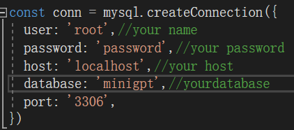

2. 使用node.js 启动app.js
   
   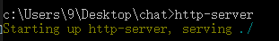

3. 启动本地服务器(这里使用http-server)
   
   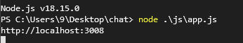

## 演示：

1. 初始页面：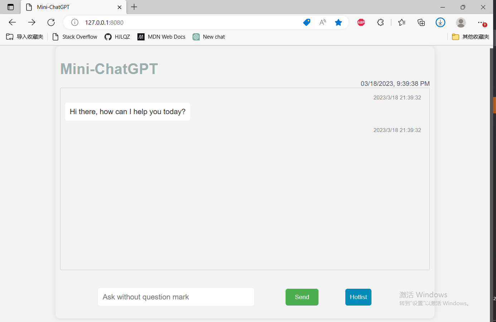

2. 输入框自动联想补全数据库对应问题。
   
   按上/下箭头键切换补全回答，点击"Send"或enter键提交问题：
   
   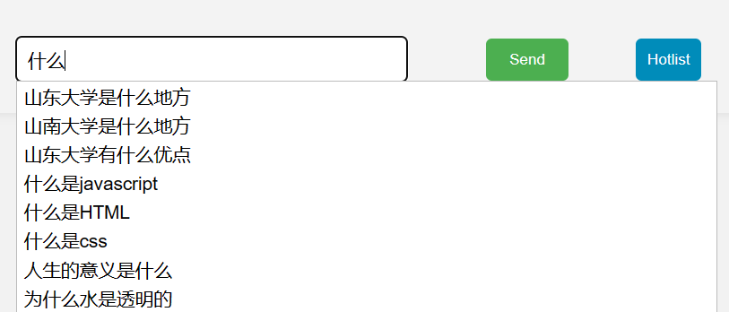

3. 这里选择第一条问题进行提问，回答可以正常显示：

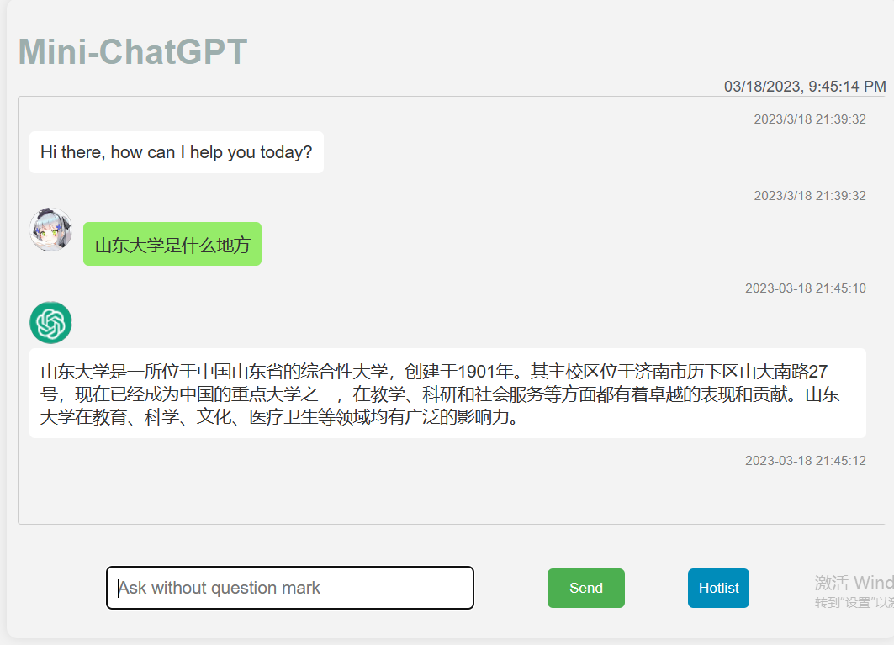

4. 询问无关内容，回答为：

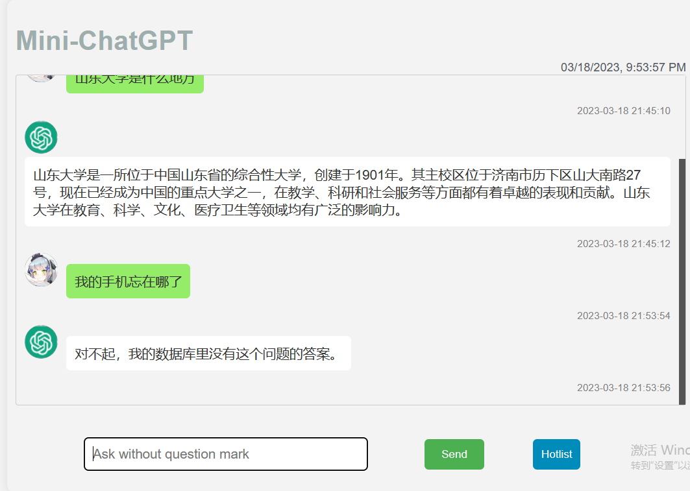

5. 点击"Hotlist"按钮，出现实时热点排行榜。

点击"刷新"按钮排行榜实时刷新，点击"关闭"按钮关闭热点排行榜：

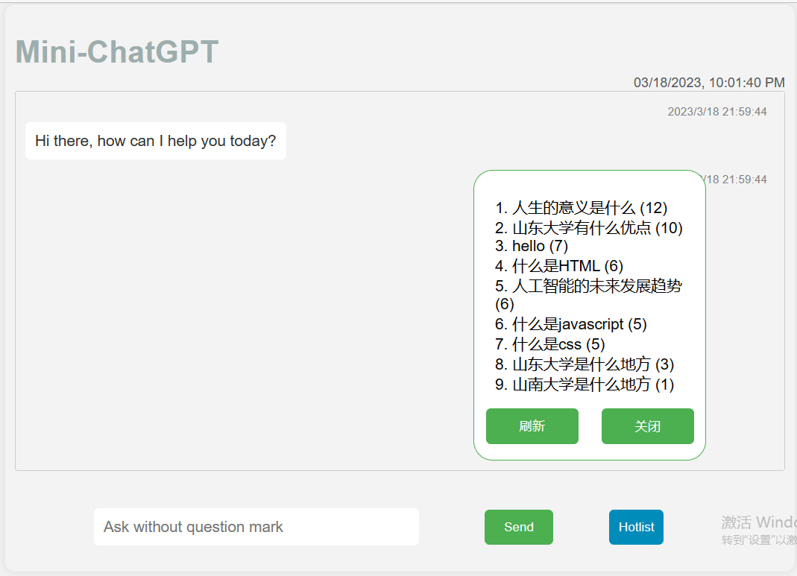

6. 输入框与热点排行榜具有自拖动功能。

> 若发生重叠，热点排行榜的显示优先级更高：

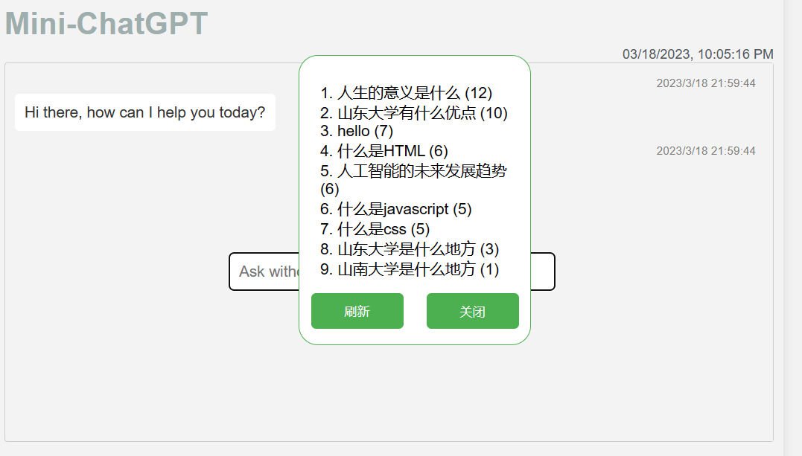

## 过程素材：

[lance2016/chat: 基于chatgpt生成的的聊天工具前端界面
(github.com)](https://github.com/lance2016/chat)

[mikesun1992/autocomplete: 输入框自动补全功能
(github.com)](https://github.com/mikesun1992/autocomplete)

## **更多：**

并发访问限制使用semaphore：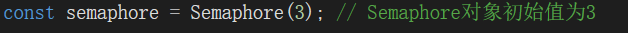

表结构：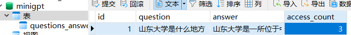

过程情况：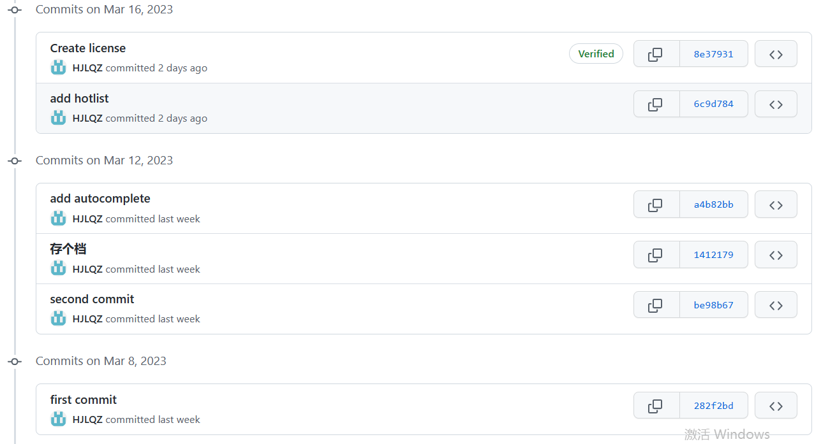
